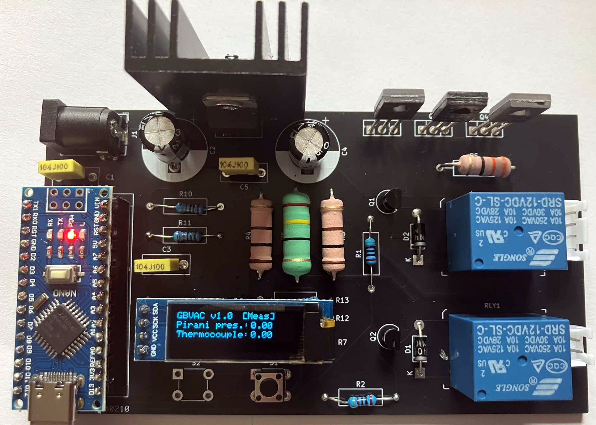

# Vacuum gauge
Simple Arduino-based vacuum gauge for Pirani and Thermocouple sensor types

### Description
While developing a vacuum system used for homemade PVD sputtering aparatus I felt the need of a simple and cheap vacuum gauge that can measure pressures as low as 1 Pa. I was not able to find online a finished DIY project thus I created one. The main idea is to use a standard thermocouple sensor at first (some of them are expensive) and then try to transition to a simple Pirani type sensor which can even be a small lightbulb (the lightbulbs are commonly available and probably have relatively the same resistance and performance so once calibrated one can have very cheap sensor).

This project is still work in progress. Next steps will be to connect a thermocouple that has a datasheet (specifying the pressure in Pa and the mV output) interpolate the points from the datasheet and then place it into the arduino code. After that experiments with commonly available light bulbs can begin.
Since the lightbulbs (and some thermocouple gauges) need to operate under vacuum, two relays are added to stop the supply when the system is not under vacuum. 

### Tips
As some chinese Arduino clones do not have connected (or have them wrongly connected) protection diodes please be careful (or best advice - do not supply the board by the external supply and the USB at the same time) when you supply the board externally.

Mount all transistors and regulators on heatsinks as they will heat up during measurement.

Some cheap thermocouple gauges that I found are called: ЛТ-2 (LT-2) and ЛТ-4М (LT-4M). They can sometimes be found on ebay for a good price.

### Schematic
[You can view it here](vacuum_gauge.pdf)
### PCB
PCB is located in the pcb folder. It is created with KiCAD. You can order the PCB directly by using the production.zip (file that contains the exported gerber files).

### Arduino code
The Arduino code is located in the arduino-code folder. The code still lacks the ability to measure pressure and it is a mess (I merged several online projects). It measures the pressure in mV. As next steps conversion tables for different sensor types will be added. In order to use it, please install the libraries (Adafruit and the others) that are referenced on the top of the file.
